# Architecture Diagrams: VSCode Validator v2.3.0

**Документ:** Технические диаграммы и схемы архитектуры
**Связанный PRD:** [PRD_vscode_validator_v2.3.0.md](./PRD_vscode_validator_v2.3.0.md)
**Дата:** 2025-10-05

---

## 1. High-Level System Architecture

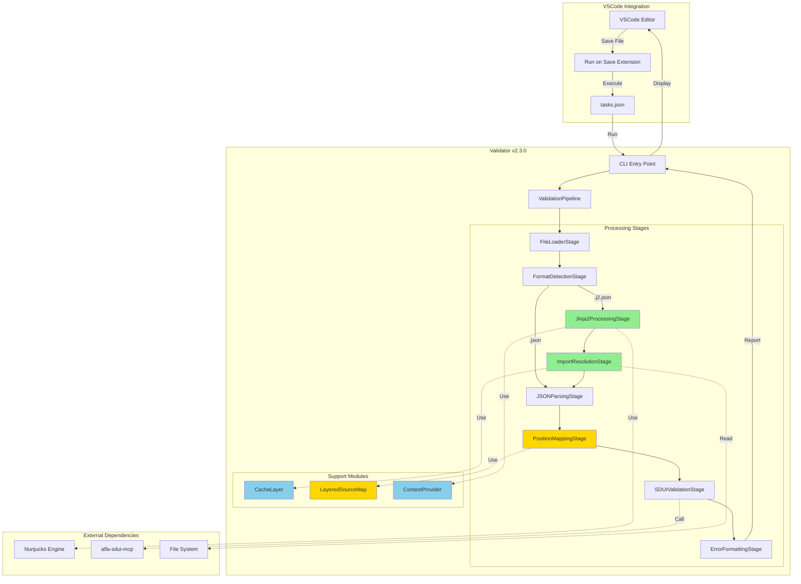

---

## 2. Validation Pipeline Flow

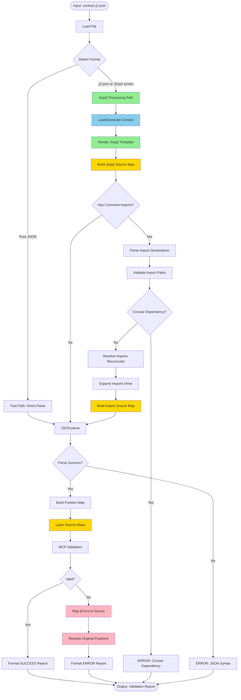

---

## 3. Source Map Layers Architecture

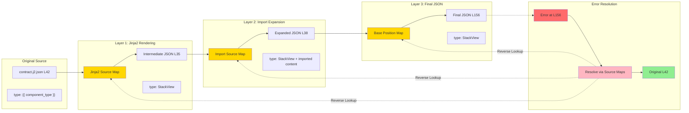

---

## 4. Import Resolution & Dependency Graph

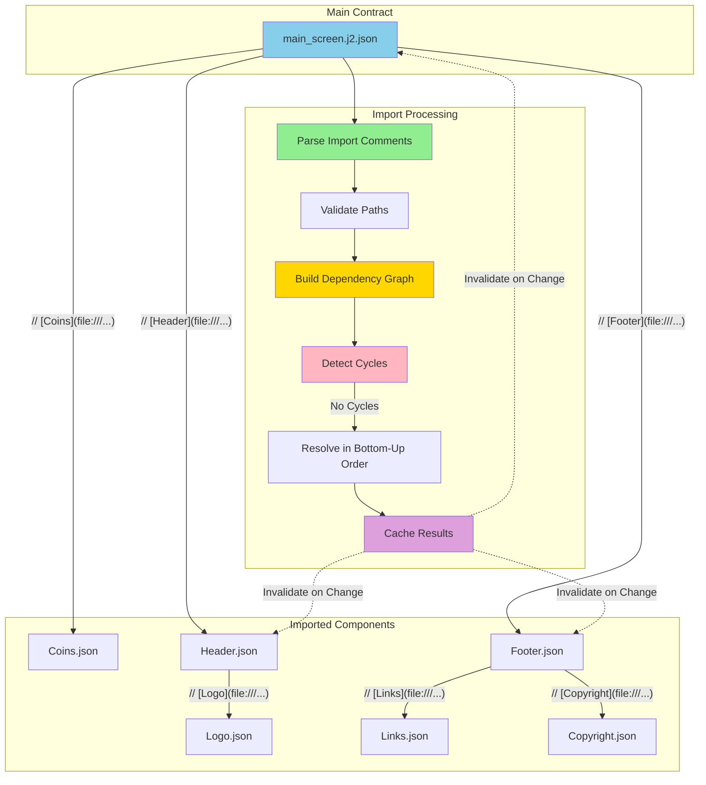

**Resolution Order (Bottom-Up):**
1. Logo, Coins, Links, Copyright (no dependencies)
2. Header (depends on Logo), Footer (depends on Links, Copyright)
3. Main (depends on all)

**Invalidation Cascade (Top-Down):**
- Logo changes → invalidate Header → invalidate Main

---

## 5. Jinja2 Processing Architecture

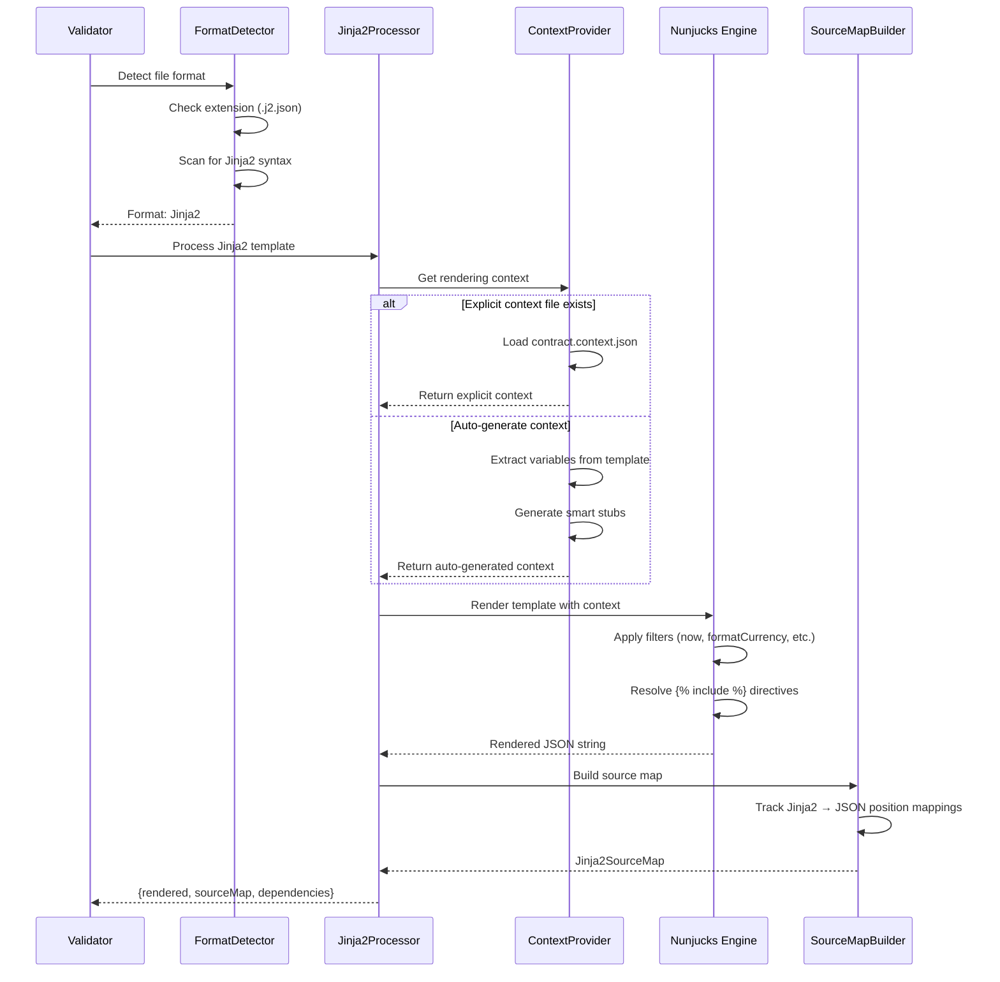

---

## 6. Cache Architecture

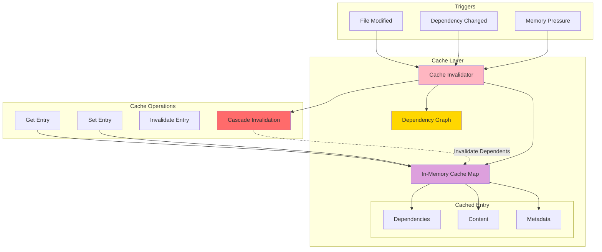

**Cache Entry Structure:**
```typescript
{
  filePath: "/path/to/file.j2.json",
  mtime: 1696512000000,
  contentHash: "abc123...",

  // Cached results
  jinja2Rendered: "...",
  importsResolved: Map<string, string>,
  positionMap: EnhancedPositionMap,
  validationReport: ValidationReport,

  // Dependency tracking
  dependencies: ["/path/to/dep1.json", "/path/to/dep2.json"],
  dependents: ["/path/to/parent.j2.json"]
}
```

---

## 7. Error Reporting Flow

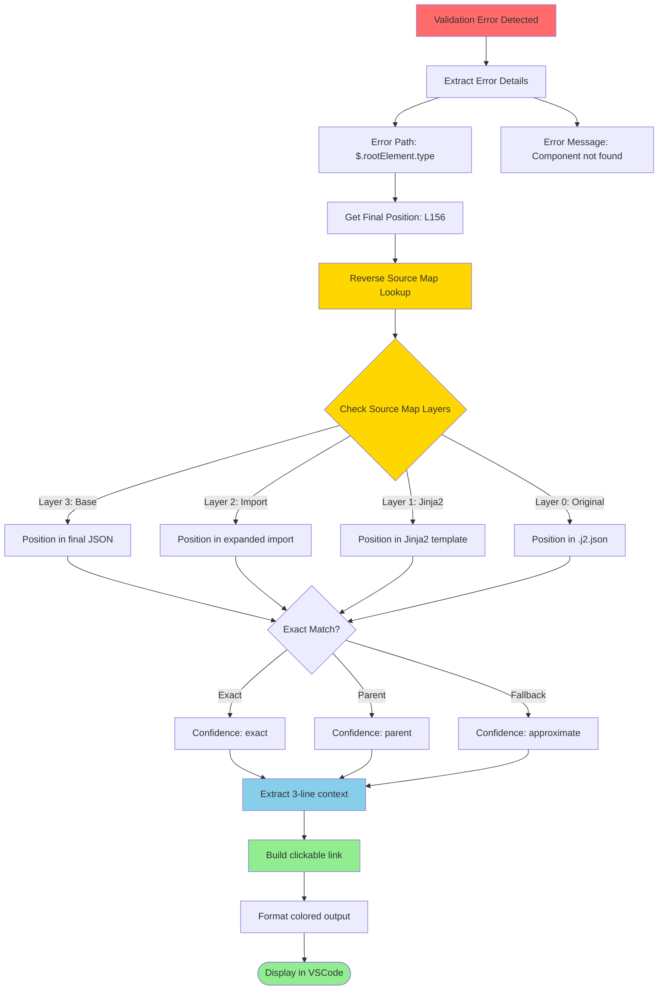

**Error Report Example:**
```
❌ [1] Component StackViewXXX not found

    Path: $.rootElement.children[0].type
    JSON Pointer: /rootElement/children/0/type
    -> file:///path/to/contract.j2.json:42:5

    Context (contract.j2.json):
    41:     "children": [
    42:       "type": "{{ component_type }}",  ◄── Error here
    43:       "content": {

    Transformation Chain:
    • Original (.j2.json L42) → Jinja2 (L35) → Import (L38) → Final (L156)
    • Confidence: exact
```

---

## 8. Class Diagram (Core Components)

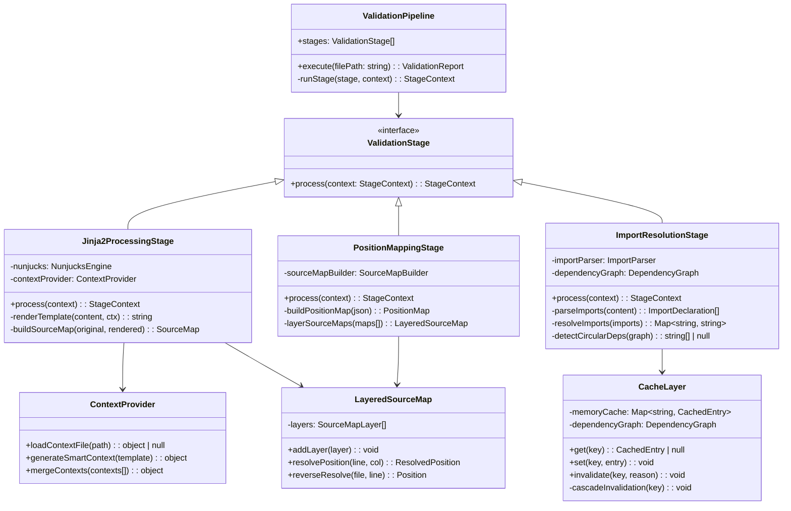

---

## 9. Data Flow Diagram

```mermaid
flowchart LR
    subgraph Input
        File[contract.j2.json]
        Context[contract.context.json]
    end

    subgraph "Stage 1: Load"
        Load[Read File Content]
        RawContent[Raw Content String]
    end

    subgraph "Stage 2: Detect"
        Detect[Format Detection]
        Format{.j2.json or Jinja2?}
    end

    subgraph "Stage 3: Jinja2"
        LoadCtx[Load Context]
        Render[Render Template]
        RenderedJSON[Rendered JSON String]
        SM1[Source Map 1]
    end

    subgraph "Stage 4: Imports"
        ParseImports[Parse Imports]
        ResolveImports[Resolve Dependencies]
        ExpandedJSON[Expanded JSON String]
        SM2[Source Map 2]
    end

    subgraph "Stage 5: Parse"
        ParseJSON[JSON.parse]
        ParsedData[Parsed JSON Object]
    end

    subgraph "Stage 6: Position"
        BuildPosMap[Build Position Map]
        LayerMaps[Layer Source Maps]
        FinalMap[Enhanced Position Map]
    end

    subgraph "Stage 7: Validate"
        MCPValidate[MCP Validator]
        RawReport[Raw Validation Report]
    end

    subgraph "Stage 8: Format"
        MapErrors[Map Errors to Source]
        FormatOutput[Format Output]
        FinalReport[Final Validation Report]
    end

    File --> Load
    Load --> RawContent
    RawContent --> Detect
    Detect --> Format

    Format -->|Yes| LoadCtx
    Context -.-> LoadCtx
    LoadCtx --> Render
    Render --> RenderedJSON
    Render --> SM1

    RenderedJSON --> ParseImports
    ParseImports --> ResolveImports
    ResolveImports --> ExpandedJSON
    ResolveImports --> SM2

    Format -->|No| ParseJSON
    ExpandedJSON --> ParseJSON
    ParseJSON --> ParsedData

    ParsedData --> BuildPosMap
    BuildPosMap --> LayerMaps
    SM1 -.-> LayerMaps
    SM2 -.-> LayerMaps
    LayerMaps --> FinalMap

    ParsedData --> MCPValidate
    MCPValidate --> RawReport

    RawReport --> MapErrors
    FinalMap -.-> MapErrors
    MapErrors --> FormatOutput
    FormatOutput --> FinalReport

    style RenderedJSON fill:#90EE90
    style ExpandedJSON fill:#90EE90
    style FinalMap fill:#FFD700
    style FinalReport fill:#87CEEB
```

---

## 10. Deployment Architecture

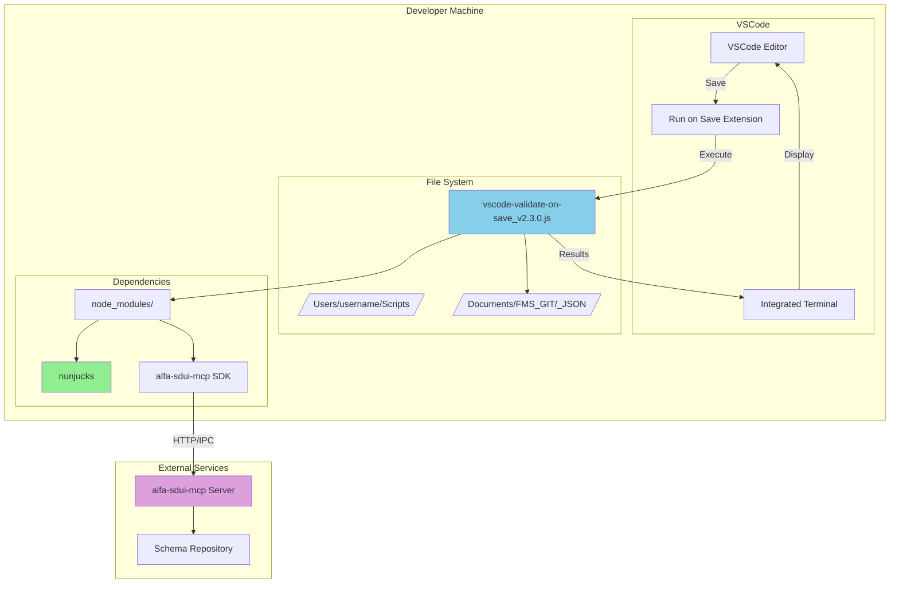

**Installation:**
```bash
# Global installation
npm install -g vscode-validate-on-save@2.3.0

# Or local in Scripts/
cd /Users/username/Scripts
npm install vscode-validate-on-save@2.3.0
```

**VSCode Configuration:**
```json
// .vscode/tasks.json
{
  "version": "2.0.0",
  "tasks": [{
    "label": "Validate SDUI Contract",
    "type": "shell",
    "command": "node",
    "args": [
      "/Users/username/Scripts/vscode-validate-on-save_v2.3.0.js",
      "${file}"
    ],
    "problemMatcher": []
  }]
}

// .vscode/settings.json
{
  "emeraldwalk.runonsave": {
    "commands": [{
      "match": ".*\\.(json|j2\\.json)$",
      "cmd": "node /Users/username/Scripts/vscode-validate-on-save_v2.3.0.js ${file}"
    }]
  }
}
```

---

## 11. Performance Optimization Strategy

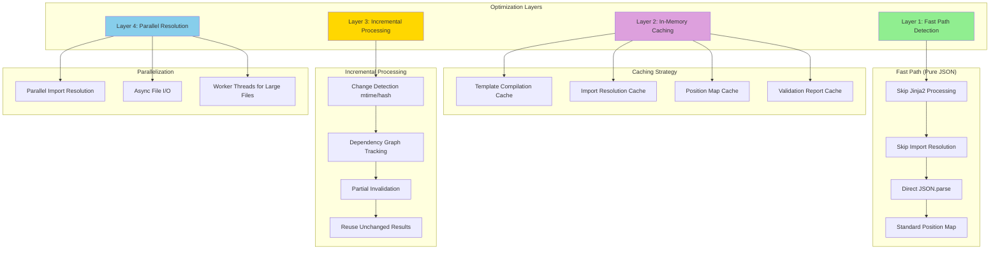

**Performance Targets:**
- Pure JSON: < 200ms (no regression from v2.2.0)
- .j2.json < 50KB: < 500ms
- .j2.json < 200KB: < 1000ms
- Cache hit: < 50ms

---

## 12. Error Handling Strategy

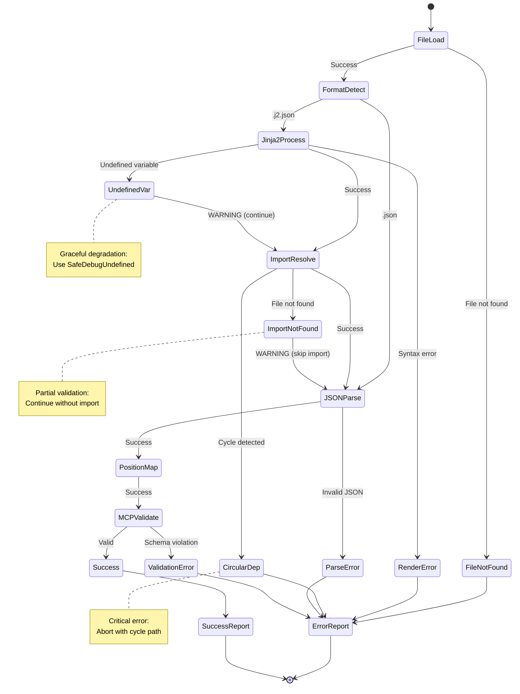

**Error Severity Levels:**
- **CRITICAL:** Circular dependency, Jinja2 syntax error, JSON parse error
- **ERROR:** Missing required field, invalid component type
- **WARNING:** Undefined variable, missing import file, approximate position

---

## Conclusion

Эти диаграммы иллюстрируют ключевые аспекты архитектуры VSCode Validator v2.3.0:

1. **Modular Pipeline:** Изолированные stages для гибкости и тестируемости
2. **Layered Source Maps:** Точное отслеживание позиций через все трансформации
3. **Intelligent Caching:** Минимизация повторных вычислений
4. **Graceful Error Handling:** Partial validation при non-critical ошибках
5. **Performance Optimization:** Fast path для pure JSON, параллелизация, кеширование

Для детальных требований см. [полный PRD](./PRD_vscode_validator_v2.3.0.md).

---

**Prepared by:** Requirements Analysis Agent
**Date:** 2025-10-05
**Version:** 1.0
