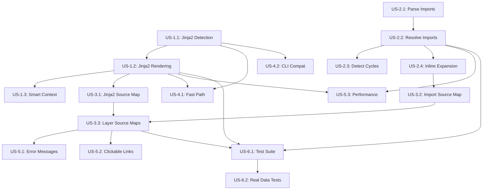

# User Stories: VSCode Validator v2.3.0

**Документ:** Детальные User Stories с Acceptance Criteria
**Связанный PRD:** [PRD_vscode_validator_v2.3.0.md](./PRD_vscode_validator_v2.3.0.md)
**Дата:** 2025-10-05

---

## Epic 1: Jinja2 Template Support

### US-1.1: Automatic Jinja2 Detection

**As a** SDUI Developer
**I want** the validator to automatically detect Jinja2 templates
**So that** I don't need to manually specify the file format

#### Acceptance Criteria

**Scenario 1: Detect .j2.json Extension**
```gherkin
Given a file named "contract.j2.json"
When the validator processes the file
Then it should recognize the format as Jinja2
And process the file through Jinja2 rendering pipeline
```

**Scenario 2: Detect Jinja2 Syntax in .json File**
```gherkin
Given a file named "contract.json"
And the file contains "{{ variable }}" or ""
When the validator processes the file
Then it should recognize Jinja2 syntax
And show INFO message "Detected Jinja2, consider renaming to .j2.json"
And process the file through Jinja2 rendering pipeline
```

**Scenario 3: Pure JSON Fast Path**
```gherkin
Given a file named "contract.json"
And the file contains only valid JSON without Jinja2 syntax
When the validator processes the file
Then it should use fast path (direct JSON.parse)
And NOT invoke Jinja2 processor
And performance should match v2.2.0 baseline
```

**Scenario 4: Pure Jinja2 Template (No JSON)**
```gherkin
Given a file starts with "{# Jinja2 Template #}"
And the file contains  directives
When the validator processes the file
Then it should render Jinja2 BEFORE attempting JSON parse
And handle templates that are not valid JSON before rendering
```

#### Definition of Done
- [ ] Format detection implemented in FormatDetectionStage
- [ ] Auto-detection regex tested with 20+ real-world files
- [ ] INFO message shown for mixed .json files
- [ ] Fast path performance regression tests pass
- [ ] Unit tests cover all 4 scenarios
- [ ] Documentation updated with detection logic

---

### US-1.2: Jinja2 Template Rendering

**As a** SDUI Developer
**I want** the validator to render Jinja2 templates with proper context
**So that** I can use dynamic variables in my contracts

#### Acceptance Criteria

**Scenario 1: Render Simple Variables**
```gherkin
Given a template contains "{{ user.name }}"
And context is {"user": {"name": "TestUser"}}
When the validator renders the template
Then the output should contain "TestUser"
And no undefined variable warnings
```

**Scenario 2: Render Conditional Blocks**
```gherkin
Given a template contains "..."
And context is {"show_header": true}
When the validator renders the template
Then the conditional block should be included in output
```

**Scenario 3: Undefined Variable Warning**
```gherkin
Given a template contains "{{ undefined_var }}"
And no context provided
When the validator renders the template
Then it should show WARNING "Variable 'undefined_var' is undefined"
And use SafeDebugUndefined as fallback value
And continue rendering (not abort)
```

**Scenario 4: Custom Filters**
```gherkin
Given a template contains "{{ date | formatDate('%Y-%m-%d') }}"
And context is {"date": "2025-10-05T12:00:00Z"}
When the validator renders the template
Then the output should contain "2025-10-05"
And all custom filters (now, formatCurrency, tojson, etc.) work correctly
```

**Scenario 5: Include Directives**
```gherkin
Given a template contains ""
And 'parts/header.j2' exists in the same directory
When the validator renders the template
Then the content of header.j2 should be included
And dependencies tracked for cache invalidation
```

#### Definition of Done
- [ ] Nunjucks integration complete
- [ ] All custom filters from jinja_hot_reload_v3.7.0 ported
- [ ] SafeDebugUndefined class implemented
- [ ] Include directive resolution working
- [ ] Unit tests for all 5 scenarios
- [ ] Performance: < 100ms for 50KB template
- [ ] Documentation: supported Jinja2 features

---

### US-1.3: Smart Context Generation

**As a** SDUI Developer
**I want** the validator to auto-generate context for undefined variables
**So that** I don't need to create separate context files for every template

#### Acceptance Criteria

**Scenario 1: Auto-Generate Simple Variables**
```gherkin
Given a template contains "{{ title }}" and "{{ count }}"
And no explicit context file exists
When the validator renders the template
Then it should auto-generate {"title": "string", "count": 0}
And use these stub values for rendering
```

**Scenario 2: Auto-Generate Nested Objects**
```gherkin
Given a template contains "{{ user.profile.name }}"
And no explicit context file exists
When the validator renders the template
Then it should auto-generate {"user": {"profile": {"name": "string"}}}
```

**Scenario 3: Use Explicit Context File**
```gherkin
Given a template file is "contract.j2.json"
And a file "contract.context.json" exists with {"title": "Real Title"}
When the validator renders the template
Then it should use "Real Title" from explicit context
And NOT use auto-generated stubs for 'title'
```

**Scenario 4: Merge Explicit and Auto-Generated Context**
```gherkin
Given explicit context has {"title": "Real Title"}
And template also uses "{{ description }}" (not in explicit context)
When the validator renders the template
Then it should use "Real Title" for title
And auto-generate stub for description
And merged context = {"title": "Real Title", "description": "string"}
```

**Scenario 5: CLI Context Override**
```gherkin
Given validator is invoked with "--context /path/to/custom.json"
And custom.json has {"override": true}
When the validator renders the template
Then it should use custom.json as context
And ignore auto-generated context
And ignore contract.context.json
```

#### Definition of Done
- [ ] ContextProvider class implemented
- [ ] Auto-generation algorithm for nested objects
- [ ] Context file discovery (.context.json convention)
- [ ] CLI flag --context implemented
- [ ] Merge logic: explicit > auto-generated
- [ ] Unit tests for all 5 scenarios
- [ ] Documentation: context file conventions

---

## Epic 2: Comment-Import System

### US-2.1: Parse Comment-Import Declarations

**As a** SDUI Developer
**I want** to use markdown-style comments to import reusable components
**So that** I can modularize my contracts without complex build steps

#### Acceptance Criteria

**Scenario 1: Parse Single Import**
```gherkin
Given a file contains "// [Header](file:///path/to/header.json)"
When the validator parses imports
Then it should extract:
  - title: "Header"
  - path: "file:///path/to/header.json"
  - lineNumber: <actual line>
```

**Scenario 2: Parse Multiple Imports**
```gherkin
Given a file contains 3 import comments on different lines
When the validator parses imports
Then it should extract all 3 imports
And preserve order of declaration
```

**Scenario 3: Ignore Non-Import Comments**
```gherkin
Given a file contains "// Regular comment"
And "// [Invalid](http://not-file-protocol)"
When the validator parses imports
Then it should ignore regular comments
And ignore non-file:/// URLs
And only extract valid file:/// imports
```

**Scenario 4: Parse Imports in JSON Strings (Edge Case)**
```gherkin
Given a JSON value is "// [Not Import](file:///fake.json)"
When the validator parses imports
Then it should NOT extract this (it's inside a string)
And only extract comments outside JSON strings
```

#### Definition of Done
- [ ] ImportParser class with IMPORT_PATTERN regex
- [ ] String context detection (ignore imports in JSON strings)
- [ ] Unit tests for all 4 scenarios
- [ ] Edge case: imports in multi-line strings
- [ ] Documentation: import syntax specification

**Import Pattern Regex:**
```typescript
const IMPORT_PATTERN = /\/\/ \[(.*?)\]\((file:\/\/\/.*?\.json)\)/g;
```

---

### US-2.2: Resolve Import Dependencies

**As a** SDUI Developer
**I want** the validator to recursively resolve all imported files
**So that** I can nest imports (imports within imports)

#### Acceptance Criteria

**Scenario 1: Resolve Single-Level Import**
```gherkin
Given main.j2.json imports header.json
And header.json is a valid JSON file
When the validator resolves imports
Then it should read header.json content
And inline the content at import location
```

**Scenario 2: Resolve Nested Imports**
```gherkin
Given main.j2.json imports header.json
And header.json imports logo.json
When the validator resolves imports
Then it should:
  1. Resolve logo.json first (bottom-up)
  2. Inline logo.json into header.json
  3. Inline expanded header.json into main.j2.json
And final result has all imports expanded
```

**Scenario 3: Handle Missing Import File**
```gherkin
Given main.j2.json imports missing.json
And missing.json does NOT exist
When the validator resolves imports
Then it should show WARNING "Import file not found: missing.json"
And show import declaration line number
And continue validation (skip this import)
```

**Scenario 4: Handle Invalid JSON in Import**
```gherkin
Given main.j2.json imports broken.json
And broken.json contains invalid JSON syntax
When the validator resolves imports
Then it should show ERROR "Invalid JSON in imported file: broken.json"
And include parse error details
And abort validation (cannot continue)
```

#### Definition of Done
- [ ] ImportResolver class with recursive resolution
- [ ] Bottom-up resolution order (dependencies first)
- [ ] File existence check before reading
- [ ] JSON validation of imported files
- [ ] Graceful error handling (WARNING vs ERROR)
- [ ] Unit tests for all 4 scenarios
- [ ] Integration test: 3-level nested imports

---

### US-2.3: Detect Circular Dependencies

**As a** SDUI Developer
**I want** the validator to detect circular import dependencies
**So that** I get a clear error message instead of infinite loop

#### Acceptance Criteria

**Scenario 1: Detect Direct Circular Dependency**
```gherkin
Given a.json imports b.json
And b.json imports a.json
When the validator resolves imports
Then it should detect circular dependency
And show ERROR "Circular dependency detected: a.json → b.json → a.json"
And abort validation
```

**Scenario 2: Detect Indirect Circular Dependency**
```gherkin
Given a.json imports b.json
And b.json imports c.json
And c.json imports a.json
When the validator resolves imports
Then it should detect circular dependency
And show ERROR with full cycle path: "a.json → b.json → c.json → a.json"
```

**Scenario 3: No False Positives (Diamond Dependency)**
```gherkin
Given a.json imports b.json and c.json
And both b.json and c.json import d.json
When the validator resolves imports
Then it should NOT report circular dependency
And successfully resolve all imports
And d.json is included only once in final output
```

**Scenario 4: Self-Import Detection**
```gherkin
Given a.json imports a.json (self-import)
When the validator resolves imports
Then it should detect self-import
And show ERROR "File imports itself: a.json"
And abort validation
```

#### Definition of Done
- [ ] DependencyGraph class with cycle detection
- [ ] Cycle detection algorithm (DFS-based)
- [ ] Diamond dependency test (no false positive)
- [ ] Self-import edge case handled
- [ ] Error message includes full cycle path
- [ ] Unit tests for all 4 scenarios
- [ ] Documentation: dependency resolution rules

**Cycle Detection Algorithm:**
```typescript
function detectCycle(graph: DependencyGraph): string[] | null {
  // DFS with visited set and recursion stack
  // Return cycle path if found, null otherwise
}
```

---

### US-2.4: Inline Import Expansion

**As a** SDUI Developer
**I want** imported JSON to be inlined at the import comment location
**So that** the final contract is a single, self-contained document

#### Acceptance Criteria

**Scenario 1: Inline at Comment Location**
```gherkin
Given a file has:
  {
    // [Header](file:///header.json)
    "footer": {...}
  }
And header.json is {"header": "content"}
When the validator expands imports
Then the output should be:
  {
    "header": "content",
    "footer": {...}
  }
And import comment removed
```

**Scenario 2: Preserve Surrounding JSON Structure**
```gherkin
Given import is in the middle of an array:
  [
    {"item1": "a"},
    // [Item2](file:///item2.json),
    {"item3": "c"}
  ]
And item2.json is {"item2": "b"}
When the validator expands imports
Then the array should be:
  [
    {"item1": "a"},
    {"item2": "b"},
    {"item3": "c"}
  ]
```

**Scenario 3: Multiple Imports in Same File**
```gherkin
Given a file has 3 import comments at different locations
When the validator expands imports
Then all 3 imports should be inlined
And each at its original comment location
And order preserved
```

**Scenario 4: Import with Trailing Comma Handling**
```gherkin
Given a file has:
  {
    // [Header](file:///header.json),
    "footer": {...}
  }
When the validator expands imports
Then it should handle trailing comma correctly
And result in valid JSON syntax
```

#### Definition of Done
- [ ] ImportExpander class with inline logic
- [ ] Preserve JSON structure and indentation
- [ ] Handle trailing commas correctly
- [ ] Multiple imports in same file
- [ ] Unit tests for all 4 scenarios
- [ ] Visual diff test: before/after expansion

---

## Epic 3: Enhanced Position Tracking

### US-3.1: Build Jinja2 Source Map

**As a** SDUI Developer
**I want** error positions to map back to the original .j2.json file
**So that** I can click on the error link and see the actual Jinja2 template

#### Acceptance Criteria

**Scenario 1: Map Simple Variable Substitution**
```gherkin
Given original .j2.json has "{{ var }}" at line 10
And after rendering, it becomes "value" at line 10
When an error occurs at line 10 in rendered JSON
Then source map should resolve to .j2.json line 10
```

**Scenario 2: Map Conditional Block Expansion**
```gherkin
Given original has "..." at lines 5-10
And after rendering, it expands to lines 5-15
When an error occurs at line 12 in rendered JSON
Then source map should resolve to .j2.json line 8 (inside block)
```

**Scenario 3: Map Collapsed Conditional**
```gherkin
Given original has "..." at lines 5-10
And after rendering, block is removed (lines collapsed)
When an error occurs at line 5 in rendered JSON
Then source map should resolve to .j2.json line 11 (after block)
```

**Scenario 4: Include Directive Mapping**
```gherkin
Given original has "" at line 5
And header.j2 expands to 10 lines
When an error occurs at line 7 in rendered JSON
Then source map should resolve to header.j2 line 3
And indicate source file: header.j2
```

#### Definition of Done
- [ ] Jinja2SourceMapBuilder class
- [ ] Line mapping algorithm with expansion/collapse tracking
- [ ] Include directive special handling
- [ ] Unit tests for all 4 scenarios
- [ ] Integration test: complex template with nesting
- [ ] Documentation: source map structure

**Source Map Structure:**
```typescript
interface Jinja2SourceMap {
  mappings: Array<{
    originalLine: number;
    originalFile: string;  // .j2.json or included file
    renderedLine: number;
    renderedColumn: number;
  }>;

  // Reverse lookup: rendered position → original position
  toOriginal(line: number, col: number): PositionInfo;
}
```

---

### US-3.2: Build Import Source Map

**As a** SDUI Developer
**I want** errors in imported files to show the imported file path
**So that** I can quickly locate the problematic import

#### Acceptance Criteria

**Scenario 1: Map Error to Imported File**
```gherkin
Given main.j2.json has import at line 10
And imported file is header.json
And error occurs in expanded header content
When validator formats error
Then it should show:
  - Source File: /path/to/header.json
  - Line in header.json: 5
  - Import declared at: main.j2.json:10
```

**Scenario 2: Map Error to Main File (Non-Import)**
```gherkin
Given main.j2.json has content that is NOT imported
And error occurs in this content
When validator formats error
Then it should show:
  - Source File: main.j2.json
  - Line in main.j2.json: <actual line>
```

**Scenario 3: Nested Import Error Tracking**
```gherkin
Given main.j2.json imports header.json at line 10
And header.json imports logo.json at line 5
And error occurs in logo.json content
When validator formats error
Then it should show:
  - Source File: logo.json
  - Line in logo.json: 3
  - Import chain: main.j2.json:10 → header.json:5 → logo.json
```

#### Definition of Done
- [ ] ImportSourceMapBuilder class
- [ ] Mapping: expanded position → (import file, line in import)
- [ ] Import chain tracking for nested imports
- [ ] Unit tests for all 3 scenarios
- [ ] Integration test: 3-level import chain
- [ ] Error formatter updated to show import chain

---

### US-3.3: Layer Source Maps

**As a** SDUI Developer
**I want** all transformations (Jinja2, imports, base) combined in one map
**So that** errors resolve accurately through all layers

#### Acceptance Criteria

**Scenario 1: Resolve Through Jinja2 + Import Layers**
```gherkin
Given original .j2.json at line 42
And after Jinja2 rendering, mapped to line 35
And after import expansion, mapped to line 156
When error occurs at line 156 in final JSON
Then layered source map should resolve:
  - Final: line 156
  - After import: line 38
  - After Jinja2: line 35
  - Original: .j2.json line 42
```

**Scenario 2: Fallback to Closest Parent**
```gherkin
Given exact position cannot be mapped (e.g., auto-generated field)
When layered source map resolves position
Then it should fallback to closest parent path
And mark confidence as "parent" (not "exact")
```

**Scenario 3: Approximate Fallback (L1)**
```gherkin
Given position has no mapping at any layer
When layered source map resolves position
Then it should fallback to line 1
And mark confidence as "approximate"
And show warning "⚠️ Position approximate"
```

#### Definition of Done
- [ ] LayeredSourceMap class
- [ ] Layer composition: Jinja2 + Import + Base
- [ ] Fallback strategy: exact → parent → approximate
- [ ] Confidence level annotation
- [ ] Unit tests for all 3 scenarios
- [ ] Integration test: full pipeline with all layers

**Layered Resolution Algorithm:**
```typescript
resolvePosition(finalLine, finalCol) {
  // Layer 3: Base position map
  let pos = baseMap.toOriginal(finalLine, finalCol);
  if (!pos) return fallbackToL1();

  // Layer 2: Import source map
  if (importMap) {
    pos = importMap.toOriginal(pos.line, pos.col);
    if (!pos) return fallbackToParent();
  }

  // Layer 1: Jinja2 source map
  if (jinja2Map) {
    pos = jinja2Map.toOriginal(pos.line, pos.col);
  }

  return pos || fallbackToL1();
}
```

---

## Epic 4: Backward Compatibility

### US-4.1: Pure JSON Fast Path

**As a** SDUI Developer using pure JSON
**I want** v2.3.0 to be as fast as v2.2.0 for my files
**So that** upgrading doesn't slow down my workflow

#### Acceptance Criteria

**Scenario 1: Pure JSON Performance Parity**
```gherkin
Given a pure JSON file (no Jinja2, no imports)
When validated with v2.3.0
Then performance should be ≤ v2.2.0 + 5% margin
And fast path bypasses Jinja2 and import stages
```

**Scenario 2: No Regression in Output Format**
```gherkin
Given a pure JSON file validated with v2.2.0
And the same file validated with v2.3.0
When comparing outputs
Then error messages should be identical
And position links should be identical
And progress bars format should be identical
```

**Scenario 3: Memory Footprint**
```gherkin
Given 100 pure JSON files validated sequentially
When measuring memory usage
Then v2.3.0 should use ≤ v2.2.0 + 20MB
And no memory leaks (stable memory after GC)
```

#### Definition of Done
- [ ] Fast path detection in FormatDetectionStage
- [ ] Benchmark: v2.2.0 vs v2.3.0 on 50 pure JSON files
- [ ] Performance regression tests in CI
- [ ] Memory profiling (before/after)
- [ ] All v2.2.0 tests pass on v2.3.0
- [ ] Documentation: performance guarantees

**Benchmark Example:**
```bash
# Baseline (v2.2.0)
Average: 180ms, 95th percentile: 195ms

# Target (v2.3.0)
Average: ≤ 185ms, 95th percentile: ≤ 205ms
```

---

### US-4.2: CLI Compatibility

**As a** developer with existing VSCode tasks
**I want** v2.3.0 CLI to be identical to v2.2.0
**So that** I don't need to update my tasks.json

#### Acceptance Criteria

**Scenario 1: Same CLI Signature**
```gherkin
Given VSCode task: "node validator_v2.2.0.js ${file}"
When I replace with "node validator_v2.3.0.js ${file}"
Then it should work without any changes
And no new required arguments
```

**Scenario 2: Exit Codes Unchanged**
```gherkin
Given v2.2.0 exits with code 0 for valid, 1 for invalid
When v2.3.0 validates same files
Then exit codes should be identical
```

**Scenario 3: Output Format Backward Compatible**
```gherkin
Given v2.2.0 outputs errors in specific format
When v2.3.0 validates same files
Then error format should be compatible
And VSCode problem matchers should work
```

**Scenario 4: Optional New Flags**
```gherkin
Given v2.3.0 adds new flags --context, --no-jinja2
When validator is called WITHOUT these flags
Then it should work as v2.2.0 (backward compatible defaults)
```

#### Definition of Done
- [ ] CLI argument parser backward compatible
- [ ] Exit codes unchanged
- [ ] Output format compatible (or enhanced, not changed)
- [ ] New flags are OPTIONAL
- [ ] Documentation: migration guide (no breaking changes)
- [ ] Integration test: existing VSCode tasks

---

## Epic 5: Developer Experience

### US-5.1: Helpful Error Messages

**As a** SDUI Developer
**I want** clear, actionable error messages
**So that** I can quickly fix issues without guessing

#### Acceptance Criteria

**Scenario 1: Jinja2 Syntax Error**
```gherkin
Given template has ""
When validator renders template
Then error should show:
  - "Jinja2 syntax error: expected "
  - Line number in .j2.json
  - Context: 3 lines around error
  - Suggestion: "Add  to close the block"
```

**Scenario 2: Undefined Variable**
```gherkin
Given template has "{{ user.missing_field }}"
When validator renders template
Then warning should show:
  - "Variable 'user.missing_field' is undefined"
  - Line number in .j2.json
  - Suggestion: "Add to context or use default: {{ user.missing_field | default('value') }}"
```

**Scenario 3: Import File Not Found**
```gherkin
Given import comment points to non-existent file
When validator resolves imports
Then error should show:
  - "Import file not found: /path/to/missing.json"
  - Line number of import comment
  - Suggestion: "Check file path and ensure file exists"
```

**Scenario 4: Circular Dependency**
```gherkin
Given circular import chain exists
When validator detects cycle
Then error should show:
  - "Circular dependency detected"
  - Full cycle path: a.json → b.json → c.json → a.json
  - Suggestion: "Refactor to break the cycle"
```

#### Definition of Done
- [ ] Error message templates for all error types
- [ ] Context extraction (3 lines around error)
- [ ] Actionable suggestions for common errors
- [ ] Color-coded output (red for errors, yellow for warnings)
- [ ] Unit tests: verify error message format
- [ ] Documentation: error reference guide

---

### US-5.2: Clickable Error Links

**As a** SDUI Developer in VSCode
**I want** to click on error links to jump to the exact location
**So that** I save time navigating to errors

#### Acceptance Criteria

**Scenario 1: Standard VSCode Link Format**
```gherkin
Given error at .j2.json line 42, column 5
When validator formats error
Then link should be: "file:///absolute/path/to/file.j2.json:42:5"
And clicking in VSCode terminal should open file at line 42, column 5
```

**Scenario 2: Imported File Link**
```gherkin
Given error in imported header.json at line 10
When validator formats error
Then primary link should be: "file:///path/to/header.json:10:1"
And secondary info: "Imported from main.j2.json:5"
```

**Scenario 3: Approximate Position Warning**
```gherkin
Given position cannot be mapped exactly
When validator formats error with fallback to L1
Then link should have warning: "⚠️ Position approximate"
And link: "file:///path/to/file.j2.json:1:1"
```

#### Definition of Done
- [ ] Link format matches VSCode terminal standard
- [ ] Links tested in VSCode (manually)
- [ ] Approximate position indicator
- [ ] Import chain info included
- [ ] Documentation: error link format

---

### US-5.3: Performance Feedback

**As a** SDUI Developer
**I want** to see validation performance metrics
**So that** I know if my contract is too complex

#### Acceptance Criteria

**Scenario 1: Show Processing Time**
```gherkin
Given file takes 450ms to validate
When validation completes
Then output should show:
  - "✅ Completed in 0.45s"
  - Breakdown: Jinja2 100ms, Imports 50ms, Validation 300ms
```

**Scenario 2: Show Cache Hit Info**
```gherkin
Given file is validated again without changes
When validation uses cached results
Then output should show:
  - "⚡ Cache hit (50ms)"
  - "Previously validated at <timestamp>"
```

**Scenario 3: Performance Warning**
```gherkin
Given file takes > 2 seconds to validate
When validation completes
Then output should show:
  - "⚠️ Slow validation (2.5s)"
  - "Consider: reducing imports, simplifying Jinja2 logic"
```

#### Definition of Done
- [ ] Performance timer in ValidationPipeline
- [ ] Breakdown by stage
- [ ] Cache hit/miss tracking
- [ ] Slow validation warning (threshold: 2s)
- [ ] Unit tests: performance metrics in output
- [ ] Documentation: performance tips

---

## Epic 6: Testing & Quality

### US-6.1: Comprehensive Test Suite

**As a** Validator maintainer
**I want** 80%+ test coverage
**So that** I can refactor safely

#### Acceptance Criteria

**Scenario 1: Unit Test Coverage**
```gherkin
Given all core modules (Jinja2Processor, ImportResolver, etc.)
When running coverage report
Then each module should have > 80% line coverage
And > 70% branch coverage
```

**Scenario 2: Integration Tests**
```gherkin
Given end-to-end validation scenarios
When running integration tests
Then all critical paths should be covered:
  - Pure JSON
  - .j2.json with Jinja2
  - .j2.json with imports
  - .j2.json with Jinja2 + imports
```

**Scenario 3: Regression Tests**
```gherkin
Given all v2.2.0 test cases
When running on v2.3.0
Then 100% of v2.2.0 tests should pass
And no behavioral changes (unless documented as enhancement)
```

#### Definition of Done
- [ ] Jest/Mocha test framework configured
- [ ] Unit tests: > 80% coverage
- [ ] Integration tests: 10+ scenarios
- [ ] Regression tests: all v2.2.0 tests pass
- [ ] CI pipeline runs tests on every commit
- [ ] Coverage report generated and tracked

---

### US-6.2: Real-World Test Data

**As a** Validator maintainer
**I want** to test with real production contracts
**So that** I catch edge cases early

#### Acceptance Criteria

**Scenario 1: Production Contract Test Suite**
```gherkin
Given 50 real .j2.json files from /payroll/
When running validator against each
Then all should validate successfully (or expected errors match reality)
And no crashes or hangs
```

**Scenario 2: Edge Case Collection**
```gherkin
Given known problematic patterns (deep nesting, large files, etc.)
When testing with edge case fixtures
Then validator should handle gracefully
And not crash or produce incorrect results
```

**Scenario 3: Performance Benchmarks**
```gherkin
Given large contract files (50KB, 200KB, 500KB)
When measuring validation time
Then performance should meet targets:
  - 50KB: < 500ms
  - 200KB: < 1000ms
  - 500KB: < 2000ms
```

#### Definition of Done
- [ ] Real-world test data repository created
- [ ] 50+ production contracts tested
- [ ] Edge case fixtures documented
- [ ] Performance benchmark suite
- [ ] CI runs benchmarks and fails on regression
- [ ] Documentation: test data sources

---

## Appendix A: Acceptance Criteria Checklist

### All User Stories Summary

**Epic 1: Jinja2 Template Support**
- [ ] US-1.1: Automatic Jinja2 Detection (4 scenarios)
- [ ] US-1.2: Jinja2 Template Rendering (5 scenarios)
- [ ] US-1.3: Smart Context Generation (5 scenarios)

**Epic 2: Comment-Import System**
- [ ] US-2.1: Parse Comment-Import Declarations (4 scenarios)
- [ ] US-2.2: Resolve Import Dependencies (4 scenarios)
- [ ] US-2.3: Detect Circular Dependencies (4 scenarios)
- [ ] US-2.4: Inline Import Expansion (4 scenarios)

**Epic 3: Enhanced Position Tracking**
- [ ] US-3.1: Build Jinja2 Source Map (4 scenarios)
- [ ] US-3.2: Build Import Source Map (3 scenarios)
- [ ] US-3.3: Layer Source Maps (3 scenarios)

**Epic 4: Backward Compatibility**
- [ ] US-4.1: Pure JSON Fast Path (3 scenarios)
- [ ] US-4.2: CLI Compatibility (4 scenarios)

**Epic 5: Developer Experience**
- [ ] US-5.1: Helpful Error Messages (4 scenarios)
- [ ] US-5.2: Clickable Error Links (3 scenarios)
- [ ] US-5.3: Performance Feedback (3 scenarios)

**Epic 6: Testing & Quality**
- [ ] US-6.1: Comprehensive Test Suite (3 scenarios)
- [ ] US-6.2: Real-World Test Data (3 scenarios)

**Total:** 6 Epics, 17 User Stories, 60 Scenarios

---

## Appendix B: Story Point Estimates

| Epic | User Stories | Story Points | Priority |
|------|--------------|--------------|----------|
| Epic 1: Jinja2 Support | US-1.1, 1.2, 1.3 | 13 | CRITICAL |
| Epic 2: Import System | US-2.1, 2.2, 2.3, 2.4 | 21 | CRITICAL |
| Epic 3: Position Tracking | US-3.1, 3.2, 3.3 | 13 | HIGH |
| Epic 4: Compatibility | US-4.1, 4.2 | 5 | CRITICAL |
| Epic 5: Developer UX | US-5.1, 5.2, 5.3 | 8 | MEDIUM |
| Epic 6: Testing | US-6.1, 6.2 | 13 | HIGH |

**Total Estimated Effort:** 73 Story Points (~7 weeks @ 10 SP/week)

---

## Appendix C: Story Dependencies



**Critical Path:**
US-1.1 → US-1.2 → US-3.1 → US-3.3 → US-5.1 → US-6.1 → US-6.2

**Parallel Work Opportunities:**
- Epic 2 (Imports) can be developed in parallel with Epic 1 (Jinja2)
- Epic 4 (Compatibility) can be tested concurrently with development
- Epic 5 (UX) can be incrementally added as other epics complete

---

**Prepared by:** Requirements Analysis Agent
**Date:** 2025-10-05
**Version:** 1.0
**Status:** Ready for Development
